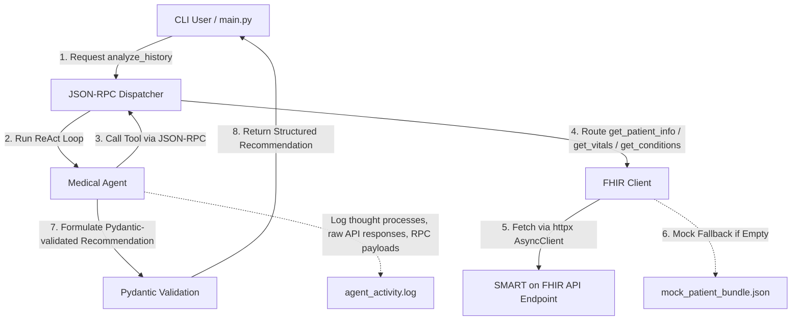

# SMART on FHIR — Medical History Analyzer

A compact Python async agent that analyzes a single patient's medical history using FHIR resources and a JSON-RPC 2.0 toolset. The project provides both a live Anthropic (Claude) mode and a deterministic offline simulation mode for reproducible clinical reasoning.

## Key Components

- `main.py`: CLI entrypoint and orchestration (async). Initializes logging and runs the agent REPL or single-run query.
- `fhir_client.py`: Async FHIR ingestion using `httpx.AsyncClient` with a local `mock_patient_bundle.json` fallback when live data is unavailable.
- `jsonrpc.py`: Minimal JSON-RPC 2.0 dispatcher and error handling for registering and invoking tool methods.
- `agent.py`: Implements the `MedicalAgent` with Pydantic schemas, a simulated ReAct loop, and an optional live ReAct loop that calls Anthropic via the official SDK.

## Architecture



## Features

- Async FHIR ingestion with `httpx` and local-file fallback for reproducible demos.
- JSON-RPC 2.0 dispatcher for tool registration (`get_patient_info`, `get_conditions`, `get_vitals`, `analyze_history`).
- ReAct-style reasoning loop:
   - Live mode: Calls Anthropic via the official SDK (`anthropic.AsyncAnthropic`) when `CLAUDE_CREDENTIALS` or `ANTHROPIC_API_KEY` is set.
   - Simulation mode: Deterministic local reasoning that performs the same JSON-RPC tool calls and returns a Pydantic-validated SOAP recommendation.
- Pydantic models to enforce the SOAP structure of final recommendations.
- Detailed auditing to `agent_activity.log` (DEBUG) capturing raw FHIR payloads, JSON-RPC frames, and agent thought logs.

## Setup

1. Install Python 3.8+.
2. Install dependencies:

```bash
pip install -r requirements.txt
```

3. (Optional) Enable Live Anthropic mode by setting an environment variable in your shell or a `.env` file:

```bash
export CLAUDE_CREDENTIALS=your-anthropic-key-here
# or on Windows PowerShell
$env:CLAUDE_CREDENTIALS = 'your-anthropic-key-here'
```

If no API key is present, the agent runs in offline simulation mode.

## Run

- Single CLI run (default patient):

```bash
python main.py
```

- Run for a specific patient ID or one-off query:

```bash
python main.py smart-1288992 "Analyze blood pressure values and suggest adjustments"
```

- Interactive REPL mode: just run `python main.py` and enter questions at the prompt.

## Tests / Verification

Run the small verification script (uses pytest / asyncio hooks):

```bash
python verify_project.py
```

## Logs

- Activity and debug logging are written to `agent_activity.log` in the project root. Look for:
   - `Raw FHIR Response` or `Mock FHIR Data Loaded` entries for data ingestion.
   - `JSON-RPC Request` / `JSON-RPC Response` frames for tool interactions.
   - `[Agent Thought-Process]` entries for simulated or live ReAct transcripts.

## Notes

- The project intentionally uses an async stack (`asyncio` + `httpx` + Anthropic async client) for non-blocking I/O.
- The mock bundle (`mock_patient_bundle.json`) provides reproducible demo data when the sandbox FHIR server returns limited records.

---

If you'd like, I can also run the verification script now or adjust any section wording. Changes are saved to [README.md](README.md).
