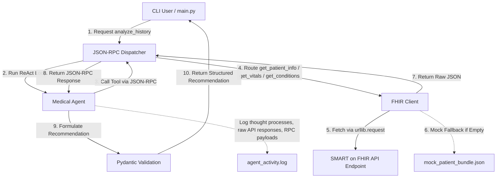

# SMART on FHIR Medical History Analyzer Agent (Anthropic Edition)

This is a Python-based Agentic AI project designed to analyze a single patient's medical history using standard FHIR resources. 

The agent utilizes a standard **JSON-RPC 2.0** interface to interact with external tools and executes a clinical **ReAct (Reasoning + Acting) loop** to process data, format reasoning thoughts, and compile a structured, Pydantic-validated medical recommendation.

## Architecture



## Features

- **Urllib Data Ingestion**: Direct fetching of patient bundles from the SMART on FHIR `$everything` endpoint.
- **Mock Data Fallback**: Integrates high-fidelity clinical fallback resources (`mock_patient_bundle.json`) containing observations (blood pressure, HbA1c, LDL) and conditions (diabetes, hypertension) since sandbox endpoints can occasionally be empty.
- **Strict JSON-RPC 2.0 interface**: Dispatcher checks frames, parameters, methods, and implements standard JSON-RPC 2.0 error specifications.
- **Dual ReAct Reasoning Engine**: 
  - **Live AI Mode**: Directly accesses the Anthropic Claude API (`claude-3-5-sonnet-20241022`) using raw `urllib.request` (no heavy SDK requirements) when configured with a `CLAUDE_CREDENTIALS` or `ANTHROPIC_API_KEY` key.
  - **Offline Simulation Mode**: Walks through a high-fidelity clinical reasoning simulation, executing the actual JSON-RPC tool calls, parsing outputs, and generating recommendations.
- **Auditable Log System**: Configures `logging` to capture and record user queries, JSON-RPC payloads, raw API payloads, and intermediate reasoning steps to `agent_activity.log` at the `DEBUG` level.

---

## Setup & Installation

1. **Prerequisites**: Ensure Python 3.8+ is installed on your system.
2. **Install Dependencies**:
   ```bash
   pip install -r requirements.txt
   ```
3. **Configure Environment** (Optional for Live AI Mode):
   - Duplicate `.env.example` to `.env`
   - Set your Anthropic API Key:
     ```env
     CLAUDE_CREDENTIALS=your-anthropic-key-here
     ```
   - If left empty, the application will run in offline simulation mode, which demonstrates the full ReAct pipeline, JSON-RPC communication, and tools.

---

## How to Run

### Main CLI Application
To run the analysis for the patient:
```bash
python main.py
```
To run for a custom patient ID or query:
```bash
python main.py smart-1288992 "Analyze blood pressure values and suggest adjustments"
```

### Verification Test Suite
To execute the automated validation suite (which runs unit tests for data ingestion, JSON-RPC handlers, and offline ReAct loops):
```bash
python verify_project.py
```

---

## Audit Logs (`agent_activity.log`)

The log file is created in the root directory. To audit the agent's chain of thought and check the evidence for its clinical decisions, check the following sections in `agent_activity.log`:

1. **Raw FHIR Response Payload**: Logs the exact raw JSON downloaded from the SMART on FHIR endpoint (labeled under `Raw API Response` or `Mock FHIR Data Loaded`).
2. **JSON-RPC Calls**: Look for `JSON-RPC Request` and `JSON-RPC Response` entries to review the exact frame communications.
3. **Agent Thoughts**: Search for `[Agent Thought-Process]` to inspect intermediate steps, such as:
   ```text
   Thought: The patient has active diagnoses including Type 2 Diabetes... I must fetch the latest clinical observations (vitals and lab values)...
   Action (JSON-RPC): { "jsonrpc": "2.0", "method": "get_vitals", ... }
   ```
